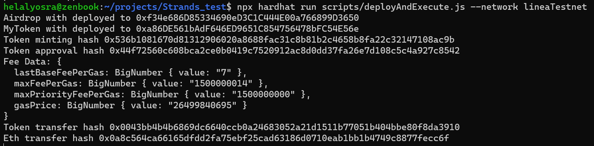

# Sample Hardhat Project

This project demonstrates a basic Hardhat use case. It comes with a sample contract, a test for that contract, and a script that deploys that contract.

Try running some of the following tasks:

```shell
npm i 
npx hardhat run scripts/deployAndExecute.js
```
# Transactions hashes 
Airdrop smart contract 
`0xf34e686D85334690eD3C1C444E00a766899D3650` 
https://explorer.goerli.linea.build/tx/0xb85556c18be48ba1fa4255c7d18078815e26494c802efd29ea2de2c79ca35c9f

MyToken smart contract 
`0xa86DE561bAdF646ED9651C854756478bFC54E56e`
https://explorer.goerli.linea.build/tx/0x7779d6f7b1f8768ef575fd1489de7c6482b9235ced66a27fc47fd4eb606f9b5f

Minting tokens 
https://explorer.goerli.linea.build/tx/0x536b1081670d81312906020a8688fac31c8b81b2c4658b8fa22c32147108ac9b 

Approval from user to airdrop smart contract 
https://explorer.goerli.linea.build/tx/0x44f72560c608bca2ce0b0419c7520912ac8d0dd37fa26e7d108c5c4a927c8542

Transfer tokens from Airdrop smart contract 
https://explorer.goerli.linea.build/tx/0x12f75549e2f57d43a2117000a5008a6bba3bbbfda8d3125c13a65c36d5e0f698

Transfer ETH from Airdrop smart contract 
https://explorer.goerli.linea.build/tx/0x0a8c564ca66165dfdd2fa75ebf25cad63186d0710eab1bb1b4749c8877fecc6f

Deploy and execute script output


Transaction replacement output

